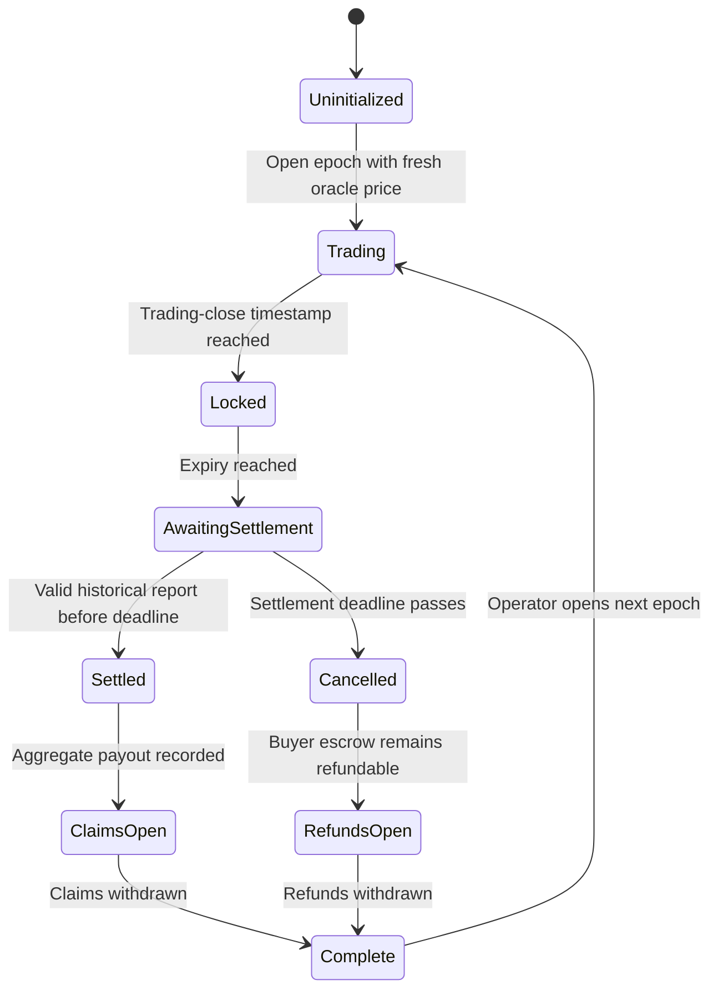
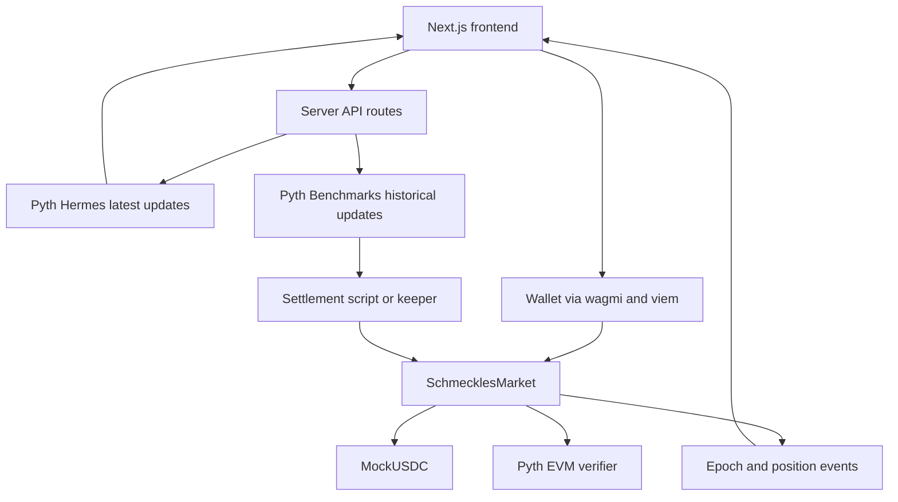

# Schmeckles

> Implementation note (2026-08-29): the runnable MVP uses Supra Pull on Monad Testnet instead of
> the Pyth path proposed below. See `README.md` and `docs/SUPRA_PREFLIGHT.md` for the deployed design.

## Jump-Aware Five-Minute Capped Calls on Monad

> **Five-minute convexity without liquidation or hidden insolvency**

**Status:** Adopted project direction  
**Target:** Monad Blitz New Delhi  
**Network:** Monad Testnet  
**Build time:** Approximately five active hours  
**Product status:** Testnet-only experimental prototype, not production-ready or financial advice

---

## 1. Executive summary

Schmeckles is a rapidly rolling market for **five-minute MON/USD capped-call tickets**.

A buyer pays a known premium for short-term upside exposure without leverage, margin, or liquidation. Every ticket has a fixed maximum payout, and the contract reserves that entire amount before accepting the purchase.

The terminal payout per ticket is:

\[
\Pi(S_T)
=
M\cdot
\operatorname{clamp}
\left(
\frac{S_T-K}{H-K},
0,
1
\right)
\]

where:

- \(S_T\) is the MON/USD settlement price
- \(K\) is the strike
- \(H\) is the cap
- \(M\) is the maximum mUSDC payout per ticket

This payoff is equivalent to a scaled bull-call spread and therefore satisfies:

\[
0\le\Pi(S_T)\le M
\]

That bound makes solvency simple and auditable:

\[
\text{reserved collateral}
=
\text{tickets sold}\times M
\]

Pricing uses an onchain Black–Scholes call-spread value as a transparent reference, then adds a bounded **Jump Guard** risk loading. The Jump Guard is motivated by research showing that models containing jumps and stochastic volatility fit cryptocurrency options better than plain Black–Scholes.

The project does **not** attempt to implement Kou, Heston, Bates, or market calibration in five hours. Instead, it makes model risk visible while ensuring that solvency does not depend on the pricing model being correct.

Settlement uses a timestamp-bounded historical oracle report rather than whichever price happens to be latest when settlement is called.

---

## 2. Thirty-second pitch

> Perpetual futures provide short-term exposure, but they require margin and expose users to liquidation. Naked USDC-written calls have the opposite problem: their writer liability is unbounded.
>
> Schmeckles creates five-minute MON/USD capped-call tickets. Buyers know their maximum loss, and the vault knows its maximum liability. Every `$10` maximum payout locks `$10` before the ticket is sold.
>
> The quote separates a Black–Scholes reference from an explicit Jump Guard because recent research shows that plain Black–Scholes misses important crypto jump risk.
>
> Monad’s approximately 300 ms blocks and 600 ms finality make the entire quote, purchase, expiry, settlement, and rollover cycle feel immediate.

---

## 3. Why this fits Monad Blitz

The public Blitz brief emphasizes:

- unconventional ideas
- experimentation on Monad Testnet
- concepts that benefit from a high-performance chain
- rapid prototyping rather than production polish
- learning and demonstrating one strong idea

The public schedule provides:

| Time | Activity |
|---|---|
| 11:30 | Hack begins |
| 13:00–14:00 | Lunch |
| 17:30 | Code freeze |
| 17:45 | Submission deadline |

That leaves approximately **five active building hours**.

Schmeckles fits this format because:

1. A full five-minute lifecycle can be demonstrated during judging.
2. The product has a clear visual interaction: quote, buy, countdown, settle, claim.
3. The mathematics can be explained and verified quickly.
4. The solvency property is visible directly in contract state.
5. Monad’s fast blocks and finality directly improve the user experience.
6. The MVP can be reduced to one underlying, one collateral token, one active epoch, and one contract.

The public brief does not expose detailed reuse or judging rules. To avoid eligibility ambiguity:

- implementation should begin fresh for this event if required;
- no Singulania project code should be reused without written approval;
- all open-source libraries must be disclosed;
- the Git commit timeline should clearly show Blitz work;
- rules shared during the event should be checked before coding begins.

---

## 4. Problem

### 4.1 Perpetuals do not provide fixed-risk convexity

Perpetual futures dominate short-term crypto speculation, but users face:

- margin management
- liquidation
- funding payments
- potentially losing more than expected during fast moves
- linear rather than convex exposure

An option buyer instead knows the maximum loss at purchase:

\[
\text{maximum buyer loss}
=
\text{premium paid}
\]

### 4.2 Uncapped calls are unsafe for a USDC-only vault

An uncapped cash-settled call pays:

\[
n\max(S_T-K,0)
\]

As \(S_T\rightarrow\infty\), the payout is unbounded. No finite USDC vault can guarantee solvency for that product.

Schmeckles solves this by defining a cap \(H\), giving a finite maximum payout.

### 4.3 Black–Scholes is not sufficient as unquestioned truth

Black–Scholes assumes continuous price paths and constant volatility. Cryptocurrency markets exhibit:

- sudden jumps
- volatility clustering
- skew
- fat tails
- discontinuous reactions to news

For a five-minute product, a single jump can dominate the entire diffusion-based premium.

Schmeckles therefore exposes Black–Scholes as a **reference component**, not an infallible fair price.

### 4.4 Expiry settlement can be manipulated by delay

A contract that reads the latest oracle price whenever someone calls after expiry allows the caller to delay settlement and potentially choose a favorable later observation.

Schmeckles instead binds settlement to an authenticated observation near the predetermined expiry timestamp.

---

## 5. Product definition

### 5.1 MVP instrument

The MVP supports exactly one product:

- Underlying: `MON/USD`
- Option type: European capped call
- Duration: exactly 300 seconds
- Collateral: test-only `MockUSDC`
- Settlement: cash-settled in `MockUSDC`
- Position type: non-transferable ticket
- Active markets: one epoch at a time
- Strike: opening MON/USD price
- Cap: fixed basis-point distance above strike
- Trading close: 30 seconds before expiry

### 5.2 Ticket terms

Each ticket has:

| Parameter | Meaning |
|---|---|
| \(K\) | Strike price |
| \(H\) | Cap price, where \(H>K\) |
| \(M\) | Maximum mUSDC payout |
| \(\sigma_q\) | Annualized pricing-volatility parameter |
| \(j\) | Upward stress-jump size |
| \(q\) | Jump stress weight |
| \(t_c\) | Trading-close timestamp |
| \(t_e\) | Expiry timestamp |
| \(t_d\) | Settlement deadline |

All terms are immutable after the epoch opens.

For the MVP:

\[
K=S_{\text{open}}
\]

\[
H=K\left(1+\frac{\text{capBps}}{10{,}000}\right)
\]

### 5.3 Buyer payoff

The payout for one ticket is:

\[
\Pi(S_T)
=
M\cdot
\operatorname{clamp}
\left(
\frac{S_T-K}{H-K},
0,
1
\right)
\]

Expanded piecewise:

\[
\Pi(S_T)=
\begin{cases}
0, & S_T\le K\\[4pt]
M\frac{S_T-K}{H-K}, & K<S_T<H\\[6pt]
M, & S_T\ge H
\end{cases}
\]

The buyer receives:

- zero below the strike;
- a linear payout between strike and cap;
- the full maximum payout at or above the cap.

### 5.4 Bull-call-spread equivalence

Define:

\[
n=\frac{M}{H-K}
\]

Then:

\[
\Pi(S_T)
=
n\left[
\max(S_T-K,0)
-
\max(S_T-H,0)
\right]
\]

This is a scaled bull-call spread.

It proves:

\[
0\le\Pi(S_T)\le M
\]

and therefore:

\[
\sum_i\Pi_i(S_T)
\le
\sum_i M_i
\]

The vault can reserve the exact maximum liability before each sale.

---

## 6. Collateral and accounting

### 6.1 Reserve-before-sale rule

Before selling \(Q\) tickets, the contract checks:

\[
\text{free collateral before payment}
\ge Q M
\]

Only then does it accept the buyer’s payment and increase maximum reserved liability by:

\[
\Delta R=QM
\]

The buyer’s incoming premium must **not** be counted toward the reserve required for that same sale.

This makes the claim “fully reserved before sale” literally true.

### 6.2 Accounting quantities

Let:

- \(C\): total mUSDC held by the contract
- \(R\): maximum liability for unsettled tickets
- \(L\): settled but unclaimed payout liability
- \(E\): refundable buyer-payment escrow
- \(F\): successfully accrued but unwithdrawn protocol fees

The primary invariant is:

\[
C\ge R+L+E+F
\]

Free collateral is:

\[
C_{\text{free}}=C-R-L-E-F
\]

The operator can withdraw only \(C_{\text{free}}\).

### 6.3 Payment escrow

Before successful settlement, the buyer’s entire payment remains escrowed.

This is required because an oracle failure may cancel the epoch. If cancellation occurs:

- the maximum reserve is released;
- the buyer can withdraw the entire paid amount;
- no protocol fee is recognized;
- refunds are pull-based.

### 6.4 Successful settlement transition

Suppose an epoch sold \(Q_e\) tickets.

Before settlement:

\[
R_e=Q_eM
\]

After receiving settlement price \(S_T\):

\[
L_e=Q_e\Pi(S_T)
\]

The released reserve is:

\[
R_e-L_e
=
Q_e\left(M-\Pi(S_T)\right)
\]

The contract must keep \(L_e\) protected until every claim has been withdrawn.

The premium portion becomes operator-owned free assets after successful settlement. The protocol-fee portion becomes \(F\).

### 6.5 No settlement loops

Every ticket in an epoch uses the same:

- strike
- cap
- maximum payout
- settlement price

The aggregate epoch payout can therefore be calculated from total ticket quantity in constant time.

Individual users claim later using their stored ticket quantity. Settlement never iterates over buyers.

---

## 7. Base option pricing

### 7.1 Black–Scholes reference

For strike \(X\), with \(r=0\):

\[
C_{BS}(S,X,T,\sigma)
=
S\Phi(d_1)-X\Phi(d_2)
\]

where:

\[
d_1
=
\frac{\ln(S/X)+\frac{\sigma^2T}{2}}
{\sigma\sqrt T}
\]

\[
d_2=d_1-\sigma\sqrt T
\]

The base capped-call value per ticket is:

\[
B
=
\frac{M}{H-K}
\left[
C_{BS}(S,K,T,\sigma_q)
-
C_{BS}(S,H,T,\sigma_q)
\right]
\]

### 7.2 Why \(r=0\) is acceptable

For a five-minute maturity, ordinary annual risk-free rates have a negligible effect.

The project should state that \(r=0\) is a short-horizon simplification, not a general pricing assumption.

### 7.3 `pricingVol` is not implied volatility

The MVP has no liquid MON options surface from which to infer an implied volatility.

Therefore, \(\sigma_q\) must be presented as:

> An annualized operator-provided pricing parameter used by the quote model.

It must not be called market-implied volatility.

It is fixed for the epoch and displayed prominently.

### 7.4 Numerical requirements

The implementation must:

- use signed fixed-point arithmetic for \(d_1\) and \(d_2\);
- encode annualized volatility consistently;
- represent time in WAD years;
- prevent five minutes from truncating to zero;
- use full-precision `mulDiv`;
- use a correct WAD square root;
- normalize oracle decimals safely;
- use a tested bounded-error normal CDF;
- handle deep ITM, ATM, and deep OTM inputs;
- explicitly define premium rounding.

The safe base-price bound is:

\[
0\le B\le M
\]

A capped call spread does **not** need to be forced above its current intrinsic payoff. Only the safe `0..M` bound should be enforced.

If numerical output exceeds the bound beyond a defined rounding tolerance, the quote must revert rather than silently invent a price.

### 7.5 Math implementation decision

Preferred approach:

1. Preflight an existing Black–Scholes implementation such as DeFiMath.
2. Confirm compiler, license, opcode, and Monad Testnet compatibility.
3. Compare contract output against high-precision reference vectors.

Alternatives include:

- PRBMath or Solady for fixed-point primitives;
- a separately tested bounded-error normal-CDF implementation.

The project must not implement:

- custom Taylor-series `ln`;
- custom Taylor-series `exp`;
- the logistic approximation

\[
\Phi(x)\approx\frac{1}{1+e^{-1.702x}}
\]

That approximation can produce negative call values when substituted into Black–Scholes.

---

## 8. Research basis

The project is informed by the 2025 preprint:

> Julia Kończal, “Pricing Options on the Cryptocurrency Futures Contracts,” arXiv:2506.14614v1.

The paper compares:

- Black–Scholes
- Variance Gamma
- Merton Jump Diffusion
- Kou double-exponential jump diffusion
- Heston stochastic volatility
- Bates / stochastic volatility with jumps

It calibrates these models against BTC and ETH futures-option data for eight maturities using a single turbulent trade date, March 11, 2024.

Reported combined MAPE values include:

| Asset | Black–Scholes | Best reported model |
|---|---:|---:|
| BTC | 9.23% | Kou: 2.64% |
| ETH | 10.5% | SVJ/Bates: 1.9% |

The useful conclusion is:

> Models containing jumps and stochastic volatility fit the studied crypto-option market better than constant-volatility Black–Scholes.

### 8.1 What Schmeckles adopts

Schmeckles adopts three lessons:

1. Crypto jump risk should not be hidden.
2. Black–Scholes should be shown as a reference, not absolute truth.
3. Protocol solvency must not rely on the pricing model being correct.

### 8.2 What Schmeckles does not claim

The paper studies:

- options on futures;
- BTC and ETH rather than MON;
- maturities much longer than five minutes;
- one market date;
- a turbulent historical period.

Therefore, it does not validate:

- five-minute MON option pricing;
- Schmeckles’s `pricingVol`;
- Schmeckles’s jump parameters;
- direct reuse of the paper’s calibrated parameters.

The paper is a research preprint, not a production-risk specification.

### 8.3 Why Kou or Bates is not implemented

Implementing a serious Kou or Bates engine would require:

- multiple calibrated parameters;
- reliable market-option observations;
- characteristic functions;
- numerical integration or Fourier inversion;
- extensive numerical testing;
- a clear risk-neutral calibration process.

That is not appropriate for a five-hour hackathon and would add complexity without a reliable MON option surface.

---

## 9. Jump Guard

### 9.1 Purpose

Jump Guard is a visible risk loading added to the Black–Scholes reference.

It is not presented as:

- calibrated jump probability;
- Kou pricing;
- Bates pricing;
- objective fair value;
- guaranteed LP compensation.

It is a simple, bounded stress model.

### 9.2 Stress construction

Let:

\[
S_J
=
S\left(
1+\frac{\text{jumpSizeBps}}{10{,}000}
\right)
\]

Calculate the ticket’s stressed terminal payoff:

\[
JPay=\Pi(S_J)
\]

Let the disclosed stress weight be:

\[
q\in[0,1]
\]

The Jump Guard is:

\[
G
=
q\max(JPay-B,0)
\]

The risk-adjusted option price is:

\[
A=B+G
\]

### 9.3 Boundedness proof

If:

\[
JPay\le B
\]

then:

\[
G=0
\quad\text{and}\quad
A=B
\]

Otherwise:

\[
A
=
B+q(JPay-B)
\]

\[
A
=
(1-q)B+qJPay
\]

Because:

\[
0\le B\le M
\]

\[
0\le JPay\le M
\]

and \(q\in[0,1]\), \(A\) is a convex combination of two values in `[0, M]`.

Therefore:

\[
0\le A\le M
\]

### 9.4 Interpretation

`jumpWeight` is a stress weight. It should not be called a probability unless a future version calibrates it using a defensible process.

Each epoch permanently exposes:

- `pricingVol`
- `jumpSizeBps`
- `jumpWeight`

This lets users understand exactly how the quote was produced.

### 9.5 Protocol fee

Let the protocol fee be:

\[
F_p=fA
\]

The all-in ticket cost is:

\[
P_{\text{all-in}}=A+F_p
\]

The MVP should reject a quote if:

\[
P_{\text{all-in}}>M
\]

This prevents a buyer from paying more than the maximum possible payout.

Protocol fees remain escrowed until successful settlement.

---

## 10. Why Monad

Official Monad documentation describes:

- approximately 10,000 TPS
- approximately 300 ms block frequency
- approximately 600 ms full finality
- Ethereum-compatible contracts and tooling
- linearly ordered transactions
- optimistic parallel execution

### 10.1 Honest Monad advantage

The product’s main Monad advantage is latency:

- purchases confirm quickly;
- the frontend can show rapid finality;
- expiry settlement can finalize rapidly after a report is submitted;
- the next epoch can open immediately after settlement;
- a five-minute product contains many finalized blocks rather than a handful.

This improves the complete lifecycle:

\[
\text{oracle update}
\rightarrow
\text{quote}
\rightarrow
\text{purchase}
\rightarrow
\text{expiry}
\rightarrow
\text{settlement}
\rightarrow
\text{next epoch}
\]

### 10.2 What parallel execution does not do

Monad parallel execution does not:

- parallelize one Black–Scholes call;
- automatically reduce its gas;
- make complex arithmetic free;
- change EVM transaction semantics;
- remove state conflicts.

All transactions remain linearly ordered.

Because purchases touch shared market and token state, this MVP should not claim that every purchase executes independently in parallel.

Future isolated markets may benefit from aggregate throughput, but that is outside the MVP.

### 10.3 Gas-limit behavior

Monad charges based on transaction gas limit rather than actual gas consumed:

\[
\text{gas paid}
=
\text{gas limit}\times\text{gas price}
\]

After measuring each transaction path, the frontend should set explicit conservative gas limits rather than allowing a wallet to submit an excessively large fallback limit.

No gas result should be presented until it has been measured.

---

## 11. Oracle design

### 11.1 Selected underlying

The preferred underlying is `MON/USD`, because Monad’s official oracle documentation explicitly lists a Pyth MON/USD feed.

Candidate configuration from the Monad documentation:

- Pyth Testnet contract:

  `0x2880aB155794e7179c9eE2e38200202908C17B43`

- MON/USD feed ID:

  `0x31491744e2dbf6df7fcf4ac0820d18a609b49076d45066d3568424e62f686cd1`

### 11.2 Mandatory event-day preflight

Pyth Core completed an upgrade on August 26, 2026. Current Pyth documentation also states that Hermes and Benchmarks require an API key.

Therefore, the following must be verified at the beginning of the event:

- active Monad Testnet Pyth contract address;
- current Solidity SDK;
- MON/USD feed availability;
- current Hermes endpoint;
- API-key authentication;
- real-time update parsing;
- historical benchmark parsing;
- update fee;
- report timestamps;
- compiler compatibility.

The candidate address must not be blindly hardcoded without this test.

The Pyth API key must remain in:

- a Next.js server route;
- environment variables; or
- a local settlement script.

It must never be shipped in the browser bundle.

### 11.3 Opening and purchase observations

`openEpoch` and `buy` receive authenticated Pyth update data.

The contract must:

1. pay the required Pyth update fee;
2. validate the configured feed ID;
3. require `price > 0`;
4. normalize the signed price and exponent safely;
5. normalize confidence using the same exponent;
6. reject reports from the future;
7. enforce a strict freshness threshold;
8. enforce:

\[
\frac{\text{confidence}}{\text{price}}
\le
\text{maxConfidenceBps}
\]

A target freshness threshold of approximately two seconds may be used only after confirming it works reliably during preflight.

The buyer submits `maxPremium` so that a price change between preview and transaction execution cannot produce an unexpectedly expensive purchase.

### 11.4 Expiry settlement

Settlement must not use the price that happens to be latest when someone calls.

Instead:

1. The epoch fixes an expiry timestamp \(t_e\).
2. A server-side script requests a Pyth historical benchmark report for that target.
3. The contract uses `parsePriceFeedUpdates`.
4. It accepts only the configured MON/USD feed.
5. The report publish time must lie within a narrow immutable window:

\[
t_e
\le
t_{\text{publish}}
\le
t_e+\Delta
\]

A candidate \(\Delta\) is two seconds, subject to preflight reliability.

### 11.5 Keeper trust assumption

A narrow timestamp range does not prove that a submitted report was globally the earliest possible report in that interval.

For the MVP:

- one authorized keeper submits settlement;
- Pyth authenticates the report contents;
- the keeper remains trusted for liveness;
- the keeper remains trusted for report selection inside the accepted interval;
- the selected report and publish timestamp are displayed publicly.

This must be disclosed in the interface and pitch.

A future version can add permissionless submissions, report challenges, or stronger deterministic historical-report selection.

### 11.6 Settlement timeout

A historical report may be submitted after expiry, but its `publishTime` must be inside the expiry observation window.

Define a later settlement deadline:

\[
t_d=t_e+\text{settlementTimeout}
\]

For example, the timeout may be ten minutes.

- `settle` is allowed only before \(t_d\).
- `cancel` is allowed only after \(t_d\).
- settlement cannot occur after cancellation;
- cancellation cannot occur before the settlement deadline.

This avoids a settlement/refund race.

If no valid report is available:

- the epoch is cancelled;
- all buyer payments are refundable;
- no fee is recognized;
- the reserve is released.

---

## 12. Epoch lifecycle



### 12.1 Lifecycle actions

1. Operator seeds mUSDC collateral.
2. Operator opens an epoch using a fresh authenticated MON/USD update.
3. Contract sets \(K\), \(H\), expiry, close time, and model parameters.
4. Buyers purchase tickets before trading close.
5. Every purchase reserves `quantity × M`.
6. Trading closes 30 seconds before expiry.
7. Keeper obtains the benchmark report.
8. Contract settles once.
9. Users claim their payout.
10. Operator manually opens the next epoch.

No automatic epoch creation is required for the MVP.

---

## 13. Architecture



There is no database requirement. Contract events and view methods are sufficient.

---

## 14. Contract plan

### `SchmecklesMarket.sol`

One focused market contract handles:

- collateral seeding;
- free-collateral withdrawal;
- epoch creation;
- quote calculation;
- ticket purchase;
- maximum-reserve accounting;
- settlement;
- cancellation;
- claims;
- refunds;
- fee accrual;
- fee withdrawal.

Avoid splitting the MVP into a router, vault, registry, and option-token system.

### `CappedCallMath.sol`

Contains:

- payoff calculation;
- base capped-call quote;
- Jump Guard;
- unit conversions;
- safe rounding;
- output-bound checks.

Existing fixed-point dependencies remain separate and attributed.

### `MockUSDC.sol`

A plain test-only ERC-20:

- six decimals;
- faucet or owner minting;
- no fee-on-transfer;
- no hooks;
- visibly named `MockUSDC` or `mUSDC`.

It must never be described as canonical or redeemable USDC.

### Suggested repository layout

```text
contracts/
├── src/
│   ├── SchmecklesMarket.sol
│   ├── CappedCallMath.sol
│   └── MockUSDC.sol
├── test/
│   ├── SchmecklesMarket.t.sol
│   ├── CappedCallMath.t.sol
│   └── SchmecklesInvariant.t.sol
└── script/
    └── Deploy.s.sol

web/
├── app/
│   ├── page.tsx
│   └── api/
│       └── pyth/
│           ├── latest/route.ts
│           └── benchmark/route.ts
├── components/
│   ├── MarketCard.tsx
│   ├── QuoteBreakdown.tsx
│   ├── PayoffChart.tsx
│   ├── SolvencyPanel.tsx
│   └── EpochHistory.tsx
└── lib/
    ├── contracts.ts
    ├── quote.ts
    └── pyth.ts

scripts/
└── settle.ts
```

---

## 15. Technology stack

### Smart contracts

- Solidity
- Foundry
- OpenZeppelin `SafeERC20`
- OpenZeppelin `ReentrancyGuard`
- Pyth Solidity SDK
- Tested fixed-point option-pricing dependency

### Frontend and server routes

- Next.js
- TypeScript
- Viem
- Wagmi
- Lightweight SVG or chart library

Next.js is preferred over a client-only Vite application because the Pyth API key must remain server-side.

### Network

- Monad Testnet
- Chain ID: `10143`
- RPC:

  `https://testnet-rpc.monad.xyz`

### Rust decision

Rust is intentionally excluded from the five-hour MVP.

A Rust keeper is a reasonable post-MVP component, but implementing it during the Blitz would add deployment and API-integration risk without improving the core demonstration.

---

## 16. Frontend

The project should have one polished screen rather than multiple incomplete pages.

### Market header

Display:

- live MON/USD price;
- active epoch;
- five-minute countdown ring;
- trading-close status;
- transaction finality status.

### Terms panel

Display:

- strike \(K\);
- cap \(H\);
- maximum payout \(M\);
- `pricingVol`;
- jump size;
- jump weight;
- protocol fee;
- oracle source;
- oracle mode: `PYTH` or `MOCK`.

### Quote breakdown

For selected ticket quantity, show:

1. Black–Scholes reference \(B\)
2. Jump Guard \(G\)
3. Risk-adjusted price \(A\)
4. Protocol fee
5. All-in payment
6. Maximum payout
7. Maximum profit

The UI should describe `pricingVol` and `jumpWeight` accurately.

### Payoff chart

Plot:

- zero payoff below \(K\);
- linear payoff between \(K\) and \(H\);
- capped payoff above \(H\);
- current spot marker;
- final settlement marker after expiry.

### Solvency panel

Display contract values directly:

- total collateral;
- maximum reserved liability;
- claimable payout liability;
- refundable escrow;
- accrued protocol fee;
- free collateral;
- coverage status.

The panel should visibly show:

> Maximum liability reserved: 100%

### Purchase action

A single prominent action:

> Buy capped call

The confirmation view must show:

- quantity;
- maximum cost;
- maximum payout;
- expiry;
- oracle update fee;
- `maxPremium`.

### Settlement view

After settlement, show:

- settlement price;
- report publish time;
- accepted timestamp window;
- oracle feed;
- user payout;
- claim action;
- epoch LP P&L;
- keeper trust disclosure.

### Monad finality display

Measure and show:

- transaction submission;
- inclusion receipt;
- finalized state if supported reliably.

Label official targets as approximate:

- approximately 300 ms block frequency;
- approximately 600 ms full finality.

Do not present measured times until actually observed.

---

## 17. Trust model

The MVP is not fully decentralized.

### Trusted operator

The operator:

- mints test mUSDC;
- seeds collateral;
- chooses future epoch parameters;
- opens epochs;
- may withdraw only free collateral.

The operator cannot modify an already opened epoch.

### Trusted settlement keeper

The keeper:

- obtains a Pyth historical report;
- chooses a report within the accepted publish-time range;
- submits settlement before the deadline.

Pyth verifies report authenticity, but the keeper remains trusted for report selection and liveness.

### Model trust

The quote depends on operator-selected:

- annualized pricing volatility;
- jump size;
- jump stress weight.

These are immutable and visible for the epoch but not market calibrated.

### Infrastructure trust

The frontend uses a server-side Pyth API key and depends on:

- Pyth services;
- Monad RPC;
- the frontend host;
- the settlement script.

### Test collateral

mUSDC has no external redemption value and may be minted by the operator.

---

## 18. Is the product needed?

The need is plausible, but not proven.

### Buyer need

Schmeckles offers:

- known maximum loss;
- no liquidation;
- no margin maintenance;
- convex short-term exposure;
- a variable linear payout rather than an all-or-nothing binary outcome;
- transparent settlement and solvency.

Potential users include:

- short-horizon directional traders;
- news and event traders;
- trading bots and agents;
- users who do not want perpetual-futures liquidation;
- users experimenting with defined-risk exposure.

### Risk-seller need

Professional risk sellers may value:

- predetermined maximum liability;
- explicit collateral reservation;
- visible model parameters;
- short capital lock duration;
- clear epoch-level P&L.

This is not automatically appropriate for passive retail LPs.

### What is unproven

TradFi 0DTE popularity establishes broad interest in short-dated convexity, but it does not prove demand for options whose entire life is five minutes.

Post-hackathon validation must measure:

- repeat purchases;
- quote acceptance;
- preferred cap widths;
- preferred expiry duration;
- willingness of risk sellers to provide capital;
- LP profitability after adverse selection.

---

## 19. Prior art and novelty

Existing prior art includes:

- Derive / Lyra
- Premia
- Hegic
- Dopex
- Rysk
- Scholes
- Ribbon and other DOVs
- Thales / Overtime Speed Markets
- Buffer Finance
- PancakeSwap prediction products
- existing onchain Black–Scholes libraries

Schmeckles does not invent:

- options;
- bull-call spreads;
- Black–Scholes;
- short-expiry derivatives;
- oracle settlement;
- fully collateralized derivatives.

Its creative contribution is the combination of:

1. five-minute MON/USD epochs;
2. non-transferable capped-call tickets;
3. exact maximum-payout reservation before sale;
4. visible Black–Scholes and jump-risk decomposition;
5. refundable escrow if settlement fails;
6. timestamp-targeted historical settlement;
7. live solvency and finality visualization.

No claim should be made that this exact combination is globally unique without a broader ecosystem audit.

---

## 20. Monetization

The buyer’s quote is:

\[
\text{buyer cost}
=
\underbrace{B}_{\text{BS reference}}
+
\underbrace{G}_{\text{risk loading}}
+
\underbrace{F_p}_{\text{protocol fee}}
\]

After successful settlement:

- the operator receives \(A=B+G\);
- the operator pays option claims;
- the protocol receives \(F_p\);
- part of the protocol fee may fund the keeper.

For one epoch:

\[
\text{LP P\&L}
=
\sum \text{risk-adjusted premiums}
-
Q_e\Pi(S_T)
\]

This can be negative.

Full collateralization prevents hidden insolvency. It does not guarantee profitability.

Schmeckles does not need:

- a token;
- points;
- undercollateralization;
- guaranteed-yield marketing;
- withdrawal restrictions designed to prevent valid winners from claiming.

---

## 21. Must ship

The MVP is complete only if it includes:

1. `MockUSDC`
2. one funded market
3. one active five-minute epoch
4. capped payoff
5. exact maximum-liability reservation
6. ticket purchase
7. onchain quote or clearly disclosed fixed-price fallback
8. authenticated Pyth settlement or clearly disclosed mock fallback
9. claim path
10. timeout cancellation
11. refund path
12. one-screen frontend
13. solvency display
14. contract tests
15. Monad Testnet deployment
16. complete end-to-end demonstration

---

## 22. Stretch goals

Only after the complete lifecycle works:

- finality stopwatch;
- live MON sparkline;
- prior-epoch LP P&L;
- automatically prepared next-epoch parameters;
- additional high-precision pricing vectors;
- event log explorer;
- permissionless benchmark submission;
- improved payoff animations.

---

## 23. Explicitly out of scope

Do not build during the Blitz:

- uncapped calls;
- puts;
- multiple assets;
- multiple active strikes;
- ERC-4626 shares;
- LP withdrawal queues;
- transferable option tokens;
- secondary trading;
- an order book;
- dynamic implied-volatility surfaces;
- Greeks dashboards;
- delta hedging;
- Kou, Heston, Bates, or FFT pricing;
- custom Taylor math;
- automatic market calibration;
- production oracle disputes;
- keeper bonding or slashing;
- upgradeable contracts;
- governance;
- a token;
- a Rust service solely for stack optics.

---

## 24. Five-hour build plan

| Time | Duration | Work |
|---|---:|---|
| 11:30–11:45 | 15 min | Verify Monad RPC, Pyth address, MON/USD feed, API key, real-time update, benchmark update, and selected pricing-library compilation |
| 11:45–12:30 | 45 min | Implement mUSDC, epoch lifecycle, capped payoff, positions, reserve accounting, escrow, claims, cancellation, and withdrawals |
| 12:30–13:00 | 30 min | Unit and fuzz tests for payoff, reserve, lifecycle, withdrawal protection, cancellation, and duplicate actions |
| 13:00–14:00 | Lunch | No active build time assumed |
| 14:00–14:45 | 45 min | Integrate tested BS call-spread pricing, WAD conversions, Jump Guard, quote bounds, fee, and reference vectors |
| 14:45–15:30 | 45 min | Integrate Pyth purchase updates and historical benchmark settlement; implement server route or settlement script |
| 15:30–16:30 | 60 min | Build the one-screen frontend and complete wallet interactions |
| 16:30–17:00 | 30 min | Deploy to Monad Testnet, wire contracts, seed collateral, and run a complete lifecycle |
| 17:00–17:30 | 30 min | Prepare prior settled epoch, rehearse demo, capture explorer links, document trust assumptions, and fix only blockers |
| **Total** | **300 min** | **Five active hours** |

---

## 25. Kill-switch checkpoints

### Oracle checkpoint: 11:45

If current Pyth integration is not working:

- stop debugging;
- switch to a conspicuously labeled `MockOracle`;
- keep the same timestamp and confidence-validation interface where possible;
- never claim authenticated Pyth settlement.

### Pricing checkpoint: 14:45

If the selected BS library does not compile, deploy, or match reference vectors:

- use one fixed immutable premium per epoch;
- show:

  > Fixed demo premium — onchain Black–Scholes incomplete

- keep the real capped payoff and solvency accounting;
- do not ship unsafe custom math.

### Core lifecycle checkpoint: 15:30

If `seed → open → buy → settle → claim` is not passing:

- stop frontend embellishment;
- remove sparkline and animation first;
- prioritize accounting, settlement, claim, cancellation, and refund.

### Integration checkpoint: 16:30

If live settlement is unstable:

- preserve a prior successful epoch;
- disclose fallback mode;
- do not manually type a price while describing it as authenticated.

### Hard freeze: 17:00

After 17:00:

- fix only demo-blocking defects;
- add no new product features.

---

## 26. Testing and invariants

### Payoff tests

Test:

- \(S_T<K\) gives zero;
- \(S_T=K\) gives zero;
- \(K<S_T<H\) gives the expected linear payout;
- \(S_T=H\) gives \(M\);
- \(S_T>H\) gives \(M\);
- payout is monotone in settlement price;
- linear-branch rounding is explicit;
- quantity multiplication cannot overflow.

Fuzz:

\[
0\le\Pi(S_T)\le M
\]

### Reserve tests

- Buying \(Q\) tickets increases maximum reserve by exactly \(QM\).
- Purchase fails if pre-payment free collateral is below \(QM\).
- Incoming payment cannot make an otherwise insolvent sale pass.
- Settlement converts maximum reserve into the exact aggregate claimable payout.
- Only the unused reserve is released.
- Claims reduce assets and claimable liability equally.
- Refunds reduce assets and escrow equally.
- Operator withdrawal preserves all liabilities.

Invariant:

\[
C\ge R+L+E+F
\]

### Quote tests

- \(B<0\) beyond tolerance reverts.
- \(B>M\) beyond tolerance reverts.
- \(JPay\in[0,M]\).
- \(G\ge0\).
- `jumpWeight = 0` gives \(A=B\).
- `JPay <= B` gives \(G=0\).
- `jumpWeight = 1` gives \(A=JPay\) when \(JPay>B\).
- all-in cost cannot exceed \(M\).
- `maxPremium` rejects adverse quote changes.

Fuzz:

\[
0\le A\le M
\]

### Fixed-point tests

- five-minute WAD time does not truncate to zero;
- 30-second remaining time does not truncate to zero;
- zero maturity is rejected;
- zero volatility is rejected or handled through a tested limit;
- signed positive and negative \(d_1,d_2\) cases match references;
- ATM, ITM, and OTM vectors match high-precision outputs;
- CDF stays in `[0,1]`;
- `ln(S/X)` has the correct sign;
- square root and `mulDiv` edge cases are covered;
- oracle exponent conversion cannot overflow.

### Oracle tests

Reject:

- stale reports;
- future-dated reports;
- wrong feed IDs;
- zero prices;
- negative prices;
- excessive confidence width;
- unsupported exponents;
- normalization overflow;
- insufficient oracle update fee;
- settlement reports before expiry;
- settlement reports after the observation window.

### Lifecycle tests

- buy before open reverts;
- zero quantity reverts;
- buy at or after trading close reverts;
- settlement before expiry reverts;
- unauthorized settlement reverts;
- duplicate settlement reverts;
- cancellation before deadline reverts;
- settlement after cancellation reverts;
- duplicate claim reverts;
- duplicate refund reverts;
- claim from cancelled epoch reverts;
- refund from settled epoch reverts;
- open terms cannot be modified;
- active epochs cannot overlap.

### Complexity requirement

No contract function may loop over:

- buyers;
- positions;
- orders;
- claims;
- refunds.

Execution cost must not grow with the number of prior buyers.

---

## 27. Risks and mitigations

| Risk | Mitigation |
|---|---|
| Pyth upgrade changed addresses or API behavior | Mandatory 15-minute event-day smoke test |
| API key exposed | Fetch updates only through server route or local script |
| Historical report unavailable | Settlement timeout, cancellation, full refund |
| Keeper selects among valid reports | Narrow window, public timestamp, explicit trust disclosure |
| Keeper disappears | Cancellation after deadline |
| Black–Scholes numerical error | Tested library, reference vectors, signed math, hard bounds |
| Pricing integration consumes too much time | Fixed immutable premium fallback |
| Model underprices crypto jumps | Visible Jump Guard and full maximum reserve |
| Jump Guard mistaken for probability | Label it stress weight everywhere |
| Oracle confidence becomes wide | Reject report rather than silently settle |
| Monad gas limit is overestimated | Measure paths and set explicit conservative limits |
| Operator withdraws liabilities | Calculate withdrawals exclusively from free collateral |
| mUSDC accounting behaves unexpectedly | Use a plain internal test ERC-20 |
| MON does not move during judging | Prepare a prior settled epoch and payoff chart |
| Frontend host fails | Keep direct scripts and explorer links |
| Contract defect | Small scope, Foundry tests, no upgradeability, testnet only |

---

## 28. Demo script

### Before judges arrive

1. Confirm Monad Testnet wallet configuration.
2. Confirm Pyth API key is not in the client bundle.
3. Prepare one prior settled epoch.
4. Seed enough mUSDC collateral.
5. Open an active epoch shortly before the judge arrives.
6. Prepare explorer links and direct settlement script.

### Four-minute walkthrough

#### 0:00–0:30 — Product

Explain:

> Schmeckles sells five-minute MON upside exposure with no liquidation. Every ticket has a known maximum cost and payout.

Show the payoff graph first.

#### 0:30–1:00 — Immutable terms

Show:

- live MON/USD;
- strike;
- cap;
- maximum payout;
- countdown;
- pricing volatility;
- jump size and stress weight.

#### 1:00–1:35 — Quote decomposition

Select two tickets and show:

- BS reference;
- Jump Guard;
- protocol fee;
- total cost;
- maximum total payout.

Explain the convex-combination bound.

#### 1:35–2:10 — Reserve before sale

Submit the purchase.

Show:

- rapid Monad inclusion/finality;
- maximum reserve increasing by exactly \(2M\);
- incoming premium held separately;
- free collateral;
- 100% maximum-liability coverage.

#### 2:10–2:55 — Settlement

Using the live or prepared epoch, show:

- target expiry;
- report publish time;
- accepted timestamp window;
- settlement price;
- payoff;
- maximum reserve converted to actual claimable liability.

Disclose the keeper trust assumption.

#### 2:55–3:25 — Claim

Submit the claim.

Show assets and claimable liability decreasing by the same amount.

Display separately:

- LP premium;
- payout;
- LP P&L;
- protocol fee.

#### 3:25–4:00 — Close

Summarize:

- fixed buyer loss;
- bounded LP liability;
- full reservation;
- visible model risk;
- timestamp-targeted settlement;
- fast Monad lifecycle.

End with the limitations:

- testnet-only;
- mock collateral;
- centralized operator and keeper;
- no market-calibrated volatility;
- not audited or production-ready.

---

## 29. Acceptance criteria

The MVP is accepted only if:

- wallet and scripts enforce chain ID `10143`;
- mUSDC is visibly labeled test-only;
- one epoch lasts exactly 300 seconds;
- trading closes before expiry;
- terms are immutable;
- ticket payout is bounded by \(M\);
- pre-payment free collateral reserves `quantity × M`;
- quote decomposition is visible;
- oracle mode is disclosed;
- settlement uses a timestamp-bounded report or visible mock fallback;
- settlement is one-time;
- claim is pull-based;
- timeout cancellation works;
- cancellation refunds full buyer payment;
- no protocol fee is earned on cancellation;
- owner cannot withdraw liabilities;
- no method iterates over users;
- tests cover payoff, quote, oracle, accounting, and lifecycle;
- contracts are deployed to Monad Testnet;
- at least one complete lifecycle succeeds;
- explorer links are ready;
- no unmeasured gas or performance claim is presented as fact.

---

## 30. Judging narrative

### Creativity

Schmeckles does not claim to invent a new formula. Its creativity comes from combining:

- five-minute option epochs;
- a bounded ticket-like payoff;
- visible model-risk pricing;
- exact reserve accounting;
- historical timestamp settlement;
- live solvency visualization.

### Technical execution

The judges can inspect a complete state transition:

\[
\text{seed}
\rightarrow
\text{open}
\rightarrow
\text{buy}
\rightarrow
\text{reserve}
\rightarrow
\text{settle}
\rightarrow
\text{claim}
\]

This is a real contract lifecycle, not a frontend simulation.

### Mathematical soundness

- The payoff is a scaled bull-call spread.
- Every ticket is bounded by \(M\).
- The Jump Guard is a bounded convex combination.
- Aggregate payout cannot exceed maximum reserve.
- Accounting has an explicit invariant.
- Unsafe numerical outputs revert.
- Research limitations are disclosed.

### Usefulness

The project tests whether traders want short-duration convex exposure with:

- no liquidation;
- fixed loss;
- simple payout;
- transparent terms.

It also gives risk sellers a clear maximum liability rather than hidden tail exposure.

### Monad relevance

Monad’s approximately 300 ms blocks and 600 ms finality support a responsive five-minute market lifecycle.

The project does not rely on false claims about parallelizing one pricing transaction.

### Feasibility

The MVP has:

- one underlying;
- one collateral token;
- one operator;
- one keeper;
- one active epoch;
- one ticket type;
- three focused contracts;
- one frontend screen.

---

## 31. Future roadmap

Do not begin these during the Blitz.

### Settlement decentralization

- permissionless benchmark submission;
- deterministic earliest-report validation;
- competing keepers;
- report challenge window;
- keeper bonds;
- dispute resolution.

### Pricing research

- collect five-minute MON/USD return data;
- estimate jump frequency and magnitude;
- compare BS, Merton, Kou, and stochastic-volatility references offchain;
- calibrate only from relevant data;
- backtest quote error and LP outcomes.

### Market structure

- isolated simultaneous epochs;
- carefully designed LP shares;
- multiple cap widths;
- professional market-maker quotes;
- additional maturities;
- puts;
- additional underlying assets.

### Production requirements

- independent audit;
- formal invariant review;
- real stablecoin due diligence;
- multisig and timelock;
- oracle redundancy;
- monitoring and incident response;
- legal review;
- economic stress testing;
- production keeper infrastructure.

### Optional Rust keeper

A Rust keeper using Alloy may be considered after the MVP’s settlement semantics are stable. It is not necessary for the Blitz prototype.

---

## 32. Honest claims

The demo may say:

- Each ticket has a fixed onchain maximum payout.
- The market reserves `quantity × M` before accepting payment.
- The payoff is equivalent to a scaled bull-call spread.
- The Jump Guard is mathematically bounded.
- Buyers do not face liquidation.
- `pricingVol` is a disclosed quote parameter.
- Pyth authenticates report contents in live-oracle mode.
- The keeper remains trusted for liveness and report selection.
- Monad’s fast blocks and finality improve the rolling-epoch experience.
- The project is testnet-only experimental software.

The demo must not say:

- This is the first five-minute option.
- This is impossible on other chains.
- Monad parallelizes one Black–Scholes calculation.
- Parallel execution makes each quote cheaper.
- The product is MEV-free.
- The keeper is trustless.
- The settlement window proves globally earliest report selection.
- `pricingVol` is market-implied volatility.
- `jumpWeight` is a calibrated jump probability.
- Jump Guard is fair value.
- The paper validates five-minute MON options.
- BTC or ETH parameters from the paper apply to MON.
- mUSDC is canonical USDC.
- LP returns are safe or guaranteed.
- The prototype is audited or production-ready.

---

## 33. Sources

### Event

- [Monad Blitz New Delhi V4](https://monad-foundation.notion.site/Monad-Blitz-New-Delhi-V4-3ca6367594f280b9b656d2afa582e7d3)

### Monad

- [Monad for Developers](https://docs.monad.xyz/introduction/monad-for-developers)
- [Parallel Execution](https://docs.monad.xyz/monad-arch/execution/parallel-execution)
- [Gas Pricing](https://docs.monad.xyz/developer-essentials/gas-pricing)
- [Oracles](https://docs.monad.xyz/tooling-and-infra/oracles)

### Pyth

- [Real-time EVM pull integration](https://docs.pyth.network/price-feeds/core/use-real-time-data/pull-integration/evm)
- [Historical Price Data / Benchmarks](https://docs.pyth.network/price-feeds/core/use-historical-price-data)
- [Pyth Core upgrade](https://docs.pyth.network/price-feeds/core/upgrade)
- [EVM upgrade notes](https://docs.pyth.network/price-feeds/core/upgrade/preparing/evm)
- [EVM contract addresses](https://docs.pyth.network/price-feeds/core/contract-addresses/evm)

### Research and mathematics

- [Pricing Options on the Cryptocurrency Futures Contracts](https://arxiv.org/html/2506.14614v1)
- [DeFiMath candidate implementation](https://github.com/MerkleBlue/defimath)
- [PRBMath](https://github.com/PaulRBerg/prb-math)
- [Solady](https://github.com/Vectorized/solady)
- [OpenZeppelin Contracts](https://github.com/OpenZeppelin/openzeppelin-contracts)

### Options background and prior art

- [Monad: A History of Crypto Options](https://blog.monad.xyz/blog/crypto-options-history)
- [Scholes: 0DTE Options in DeFi](https://blog.scholes.xyz/0dte-options-in-defi)
- [Cboe SPX 0DTE analysis](https://www.cboe.com/insights/posts/volatility-insights-evaluating-the-market-impact-of-spx-0-dte-options/)
- [Cboe State of the Options Industry 2025](https://www.cboe.com/insights/posts/the-state-of-the-options-industry-2025/)

---

> **Final project definition:** Schmeckles is a narrowly scoped Monad Testnet experiment demonstrating a mathematically bounded short-expiry payoff, explicit model-risk loading, timestamp-targeted oracle settlement, and liability-safe accounting within five active build hours.
